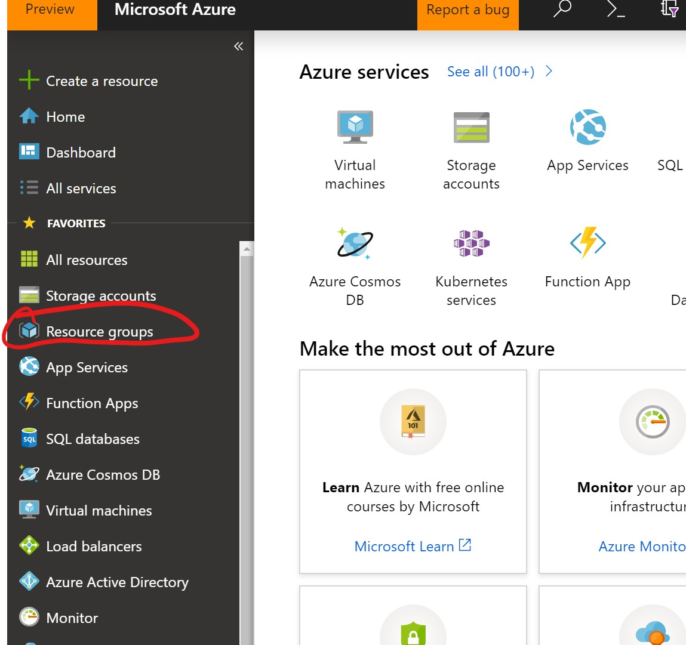
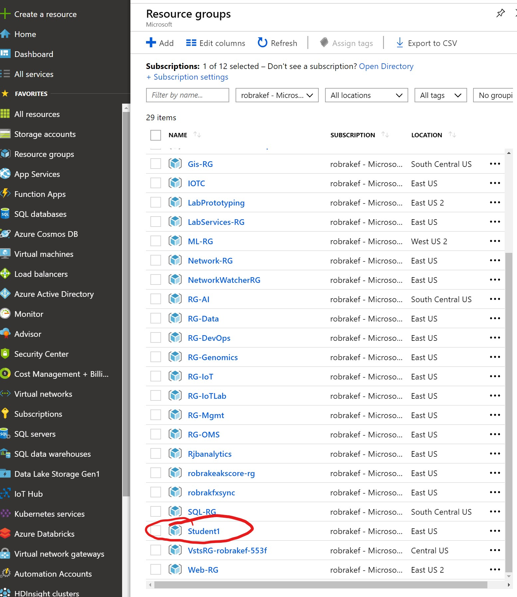
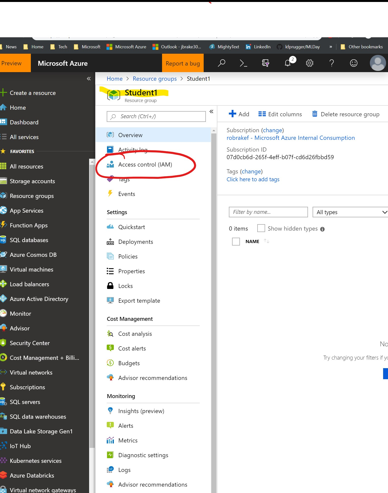
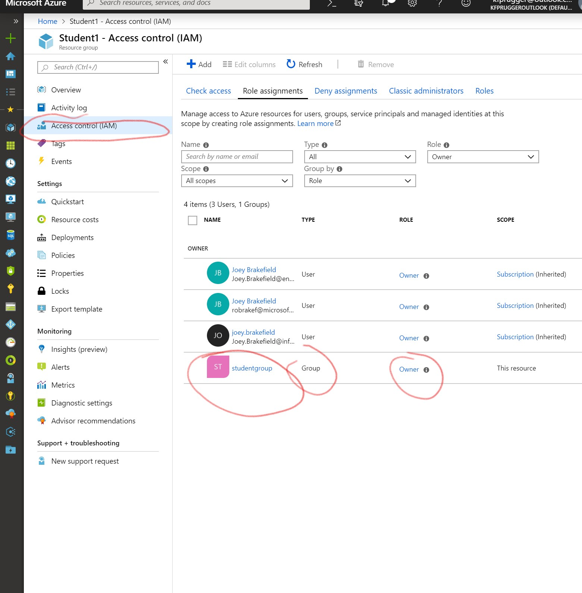
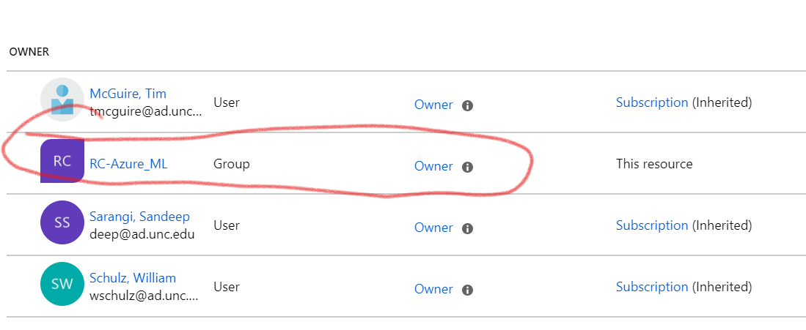
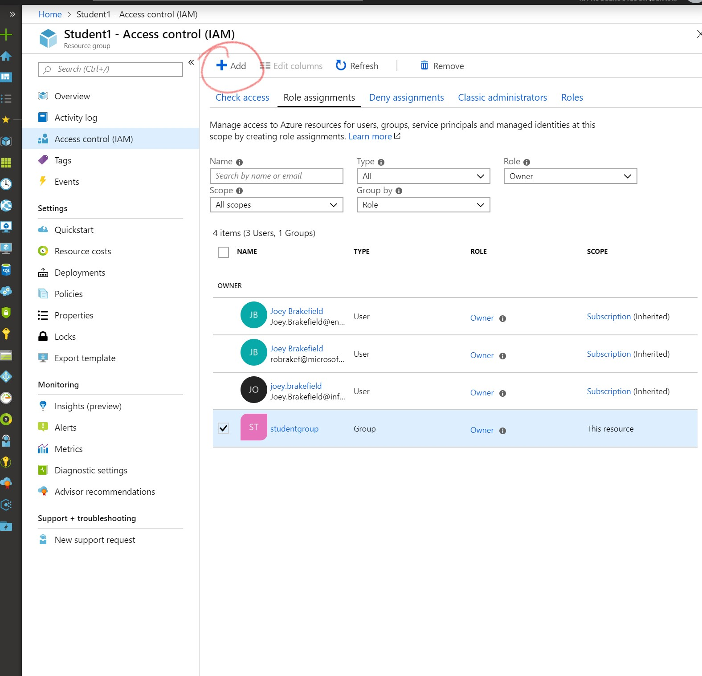
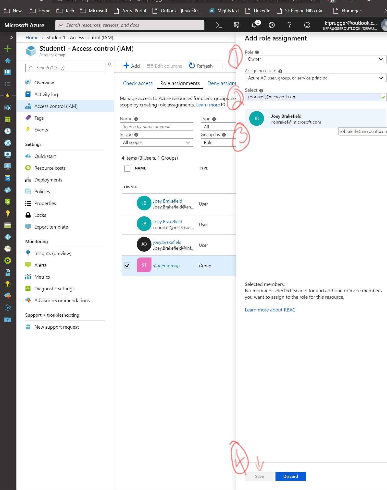
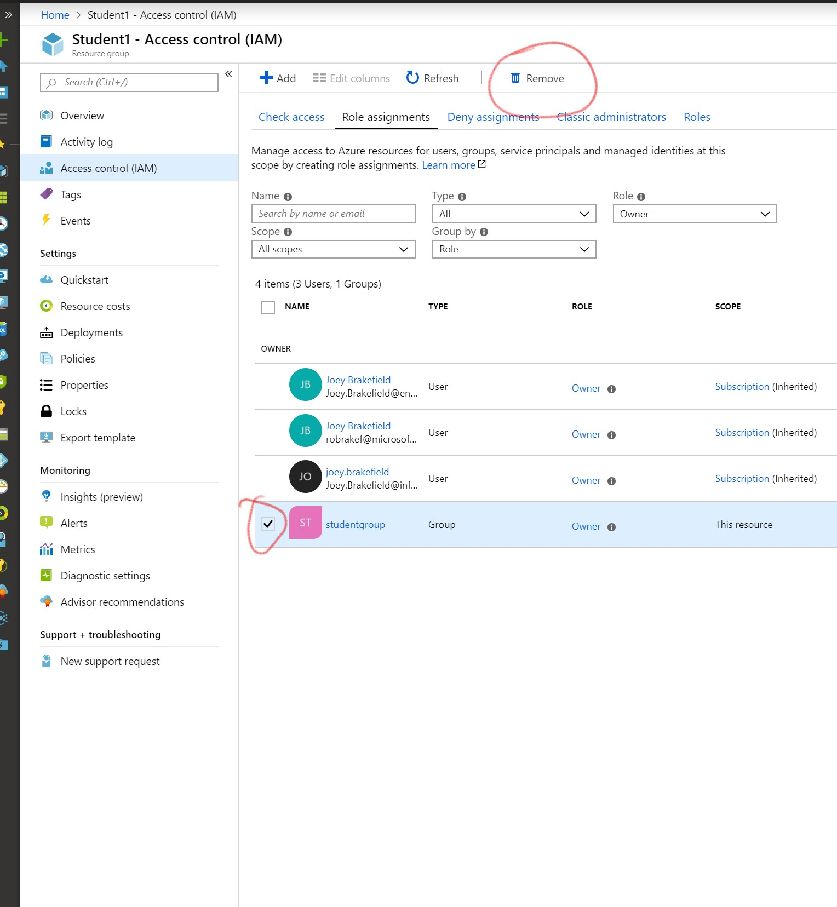

# Welcome to the AAD Walkthrough 
The purpose of this small exercise is to take the globally permissive access control list (ACL) that has been granted to all users in this session to **ALL** resources to only those you would like on your own resource, namely just you. 

Because the administrator has granted "owner" to all resource groups and YOU are a member of that group, you can reassign "owner" to yourself and remove the more permissive, expansive security group.

First, let's navigate to the Azure portal (https://portal.azure.com) and let's dive into step 1 to address the existing security controls that are on **YOUR** Resource Group so that only **YOU** have access to your little slice of Azure for the rest of the subsequent labs throughout the day.

## Azure Portal Familiarization ACL Reassignment Exercise
1. View the current permissions of your resource group by navigating to **https://portal.azure.com**. **NOTE:** This same process can be used on practically EVERY resource in Azure from Azure SQL Databases down to the network interface cards on Virtual Machines.

** 

1. Now navigate into the resource group assigned to **you** from the administrator. In this example, I am *"Student1"*.

    
**

2. Let's drill into the permissions by clicking on **Access Control (IAM)**

    
**

3. Now, let's look at who has rights.

    Click **Role Assignments** tab and then look at "Owners" under the  role assignments. ([Here's a description of all roles that come built-in](https://docs.microsoft.com/en-us/azure/active-directory/users-groups-roles/directory-assign-admin-roles))

    In my example, I used a security group called **studentgroup** and assigned it *"Owner"* rights. The next step will be to add yourself as an *"Owner"* and then remove that group. This will remove the rest of the workshop partipants' ability to assign resources to your Resource Group and ensuring that only **you** are able to put resources in your Resource Group for the rest of the day.

    
    
4. **IMPORTANT: DO THIS STEP FIRST** First, we'll add ourselves to the resource group and then we can remove the more expansive group permissions. 

    

- For **Role**, Select **Owner**. Under **Select** type in your userID that you use on-campus (e.g. janedoe@institution.edu -- in my example I'm using my specific MSFT ID: robrakef@microsoft.com). *Click the name that pops up after you type in the **Select** box*. 

-  Finally, click Save.

    
5. To remove that group and put myself in, we'll start with removing it by selecting the check box and then clicking **Remove** at the top part of the blade. Then click **Yes**.
    

## Conclusion
Now, only YOU have permission to your resource group in Azure. 

Note you can use any combination of users/groups that are being synced from on-premises Active Directory (the system that holds all of your security identities maintained by IT) as well as any combination of role assignments for almost every level of resources in Azure a la POSIX!

# [Learn More!](https://docs.microsoft.com/en-us/azure/active-directory/users-groups-roles/directory-overview-user-model)